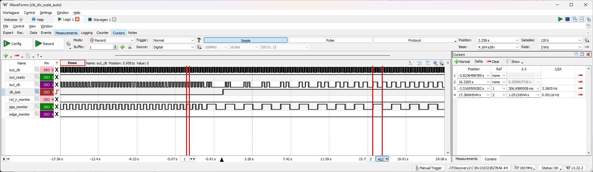

clock_divider Documentation
==============================

# Table of Contents
- [clock\_divider Documentation](#clock_divider-documentation)
- [Table of Contents](#table-of-contents)
  - [Introduction](#introduction)
    - [Baseline (Done 7/30/2024)](#baseline-done-7302024)
    - [Improvements](#improvements)
    - [Details](#details)
  - [Test Result](#test-result)
  - [Reference](#reference)
## Introduction
### Baseline (Done 7/30/2024)
- Location: ./baseline
- Assumption: Pps_clk is absolutely accurate, sys_clk is inaccurate
- Goal: Output a clock based on sys_clk which is synced to pps_clk on every pps_clk rise edge, and can have a frequency that is multiple of pps_clk's.
- How it works:
  - divisor: Calculate **diviser** by taking average of sys_clk count of **4** windows of pps_clk right after reset (or change of **SCALE**) and finalize when the difference between two consecutive **divisor**s are within the **THRESHOLD** of **16**. Doesn't change **divisor** after finalizing and stick to it all the way.
  - synchronization: Since out_clk should only sync at pps_clk rise edge, when out_clk has a frequency of larger than 1 time of the pps_clk, out_clk and pps_clk are asynchronous to each other for all other edges.
    - To make sure out_clk is synced to pps_clk at rise edge, force out_clk to rise at pps_clk rise edge.
    - To prevent the asynchronous edges from overwriting the synching edge (when the **divisor** counts less sys_clk tiks than actual tiks, hence out_clk edge that is supposed to rise with the next pps_clk rise edge would happen before the next pps_clk rise edge), count the number of fall edges in between of two pps_clk rise edges. Force the out_clk to be 0 after **SCALE** number of falls have happened.
- SCALE: Update **SCALE** using an AXI GPIO IP. Output the desired scale from PS to PL via **axi_gpio_0**. Prompt the user to enter an unsigned integer as scale with UART. 
### Improvements

- Sources
  - Files: ./improved/files
  - Vivado Project: ./improved/vivadoProject/clk_div_scale_auto
  - Vitis Project: ./improved/vitisProject/clk_div_scale_auto

- Same assuption and goal
- Adjustments needed:
  - Updating divisor: Sometimes sys_clk may change its frequency due to change in temperature, so I need to adjust **divisor** constantly.In the previous version, divisor actually gets constantly updated, but I want to make sure that the change of divisor is constantly reflected to out_clk.
  - Clock lost & threshold: It's important to detect when the clock is lost, so a warning should be given when the **difference of two consecutive divisors is too high** while also gives some leniency for sys_clk change. Currently, I say clock is lost if the current **divisor** is at least **2 times at large** as the previous one after **out_ready** is high and different of divisors is acceptible if the difference of **divisor** is under **THRESHOLD** of **16**. I need to make sure it works.
  - More customization: Adjustable number of divisor-calculating windows and adjustable SCALE is helpful. It means I need two more 32-bit GPIOs, adjusting Vitis software, and most importantly, automate the scaling of divisor-calculating windows in PL.
- Adjustments done:
  - divisor is proven to keep being updated and is reflected to out_clk. It's hard for the logic analyzer to record that many samples, but from simulation, we can see the change in sys_clk frequency at 20ms is reflected on out_clk.
    - 
  - The maximum difference acceptable between previous and current divisor for out_clk to be ready is 16, and the minimum difference of indicating clock lost is current counter being twice as large as the previous. It works in both simulation and logic analyzer
    - 
  - Using arrays of variable length, I can make the number of windows variable, but only when it's a power of two because we need to divide to get the average, and we use shifting for fast division.

### Details
- Pin Mapping (Bank 34):

  | package_pin | pin_name | JX1_pin_# | CON1_pin_# | block_pin_name | DIO_# |
  | - | - | - | - | - | - |
  | N/A | GND | N/A | 1, 2 | N/A | GND, GND |
  | T11 | JX1_LVDS_0_P | 11 | 5 | sys_clk | 0 |
  | T12 | JX1_LVDS_1_P | 12 | 6 | out_ready | 1 |
  | T10 | JX1_LVDS_0_N | 13 | 7 | out_clk | 2 |
  | U12 | JX1_LVDS_1_N | 14 | 8 | clk_lost | 3 |
  | U13 | JX1_LVDS_2_P | 17 | 9 | rst_n | W1 |
  | V12 | JX1_LVDS_3_P | 18 | 10 | pps_clk | W2 |
  | V13 | JX1_LVDS_2_N | 19 | 11 | rst_n_monitor | 4 |
  | W13 | JX1_LVDS_3_N | 20 | 12 | pps_clk_monitor | 5 |
  | T14 | JX1_LVDS_4_P | 23 | 13 | edge_monitor | 6 |

## Test Result
1. pps_clk rise edge and first out_clk rise edge always have constant delay

    We can confirm that in the steady state, out_clk rises at the second sys_clk rise edge after the sys_clk rise edge that reads pps_clk high. While at the start, out_clk rises at the third sys_clk rise edge after the sys_clk rise edge that reads pps_clk high because an additional cycle is required to set up out_ready.
  
    SCALE = 1

    first R
    

    following Rs
    
    
    

    SCALE = 2

    first R
    

    following Rs
    
    
    
2. out_clk is multiplied by the destinated amount correctly

    SCALE = 1
    

    SCALE = 2
    

    SCALE = 3
    

    SCALE = 4
    

    SCALE = 5
    
    
    SCALE = 6
    
3. when sys_clk is changed, it can still sync to pps_clk with new divisor and outputs the correct clock (tested by adjusting pps_clk)

    SCALE = 1

    changed pps_clk from 1 Hz to 1.5 Hz
    
    
    took 8 cycles to get the new frequency
    
    SCALE = 2

    changed pps_clk from 1.5 Hz to 0.5 Hz
    
    clock lost is triggered because new pps_clk frequency is at least twice as slow, but eventually out clock is adjusted

4. clk_lost is triggered when pps_clk is lost

    SCALE = 2

    changed pps_clk from 0.5 Hz to off
    
    out_clk would also stop due to lack of pps_clk

## Reference
- [Forums](https://support.xilinx.com/s/topiccatalog?language=en_US&t=1719428356954)

- [Guides for Xilinx Tools](https://digilent.com/reference/programmable-logic/guides/start)
  - [Installing Vivado, Vitis, and Digilent Board Files](https://digilent.com/reference/programmable-logic/guides/installing-vivado-and-vitis)
  - [Getting Started with Vivado and Vitis for Baremetal Software Projects](https://digilent.com/reference/programmable-logic/guides/getting-started-with-ipi)
  - [Getting Started with Vivado for Hardware-Only Designs](https://digilent.com/reference/programmable-logic/guides/getting-started-with-vivado)
  - [Using a Peripheral with a Hierarchical Block in Vivado IPI and Vitis](https://digilent.com/reference/programmable-logic/guides/hierarchical-blocks)
  - [Getting Started with Zynq Servers](https://digilent.com/reference/programmable-logic/guides/zynq-servers)
  - [Using Digilent Pmod IPs in Vivado and Vitis (Under Construction)](https://digilent.com/reference/programmable-logic/guides/getting-started-with-pmod-ips)

- [Vitis Tutorials V2023.1](https://github.com/Xilinx/Vitis-Tutorials/tree/2023.1)
  - [Versal Platform Creation Quick Start V2023.1](https://github.com/Xilinx/Vitis-Tutorials/tree/2023.1/Getting_Started/Vitis_Platform)

- [Microzed](https://www.avnet.com/wps/portal/us/products/avnet-boards/avnet-board-families/microzed/microzed-board-family/) and [AES-MBCC-BRK-G Carrier Board](https://www.avnet.com/shop/us/products/avnet-engineering-services/aes-mbcc-brk-g-3074457345635221620/)
  - [Microzed Hardware User Guide V1.7](https://www.avnet.com/wps/wcm/connect/onesite/58eaef36-f0b2-4dd4-8440-540bdc2acd3d/5276-MicroZed-HW-UG-v1-7-V1.pdf?MOD=AJPERES&CACHEID=ROOTWORKSPACE.Z18_NA5A1I41L0ICD0ABNDMDDG0000-58eaef36-f0b2-4dd4-8440-540bdc2acd3d-nDjezWU)
  - [Microzed RevB Schematic](https://www.avnet.com/wps/wcm/connect/onesite/a597668b-80fc-4d8f-b46b-78a2949179fa/MicroZed_RevB_Schematic_130617_0.pdf?MOD=AJPERES&CACHEID=ROOTWORKSPACE.Z18_NA5A1I41L0ICD0ABNDMDDG0000-a597668b-80fc-4d8f-b46b-78a2949179fa-nDjikUA)
  - [MicroZed Getting Started User Guide](https://www.avnet.com/opasdata/d120001/medias/docus/4/Avnet-MicroZed-Getting-Started-EN-User-Guide.pdf)
  - [UG-AES-MBCC-BRK-G Hardware User Guide V1.2](https://www.avnet.com/opasdata/d120001/medias/docus/178/UG-AES-MBCC-BRK-G-V1_2.pdf)
  - [MBCC-BKO RevA Schematic](https://www.avnet.com/opasdata/d120001/medias/docus/58/AES-MBCC-BRK-G_RevA_Schematic_131114.pdf)

- UART
  - [HOW TO INSTALL CP210X VIRTUAL COM PORT DRIVERS / YAESU RADIOS](https://youtu.be/vuYs4A_kcsg?feature=shared)
  - [Tera Term application](https://github.com/TeraTermProject/teraterm/releases/tag/v5.2)
  - [Setting correct baud rate](https://support.xilinx.com/s/feed/0D54U00008VPpkRSAT?language=en_US)
  
- Embedded Design Tutorial
  - [Design Example 1: Using GPIOs, Timers, and Interrupts](https://xilinx.github.io/Embedded-Design-Tutorials/docs/2021.1/build/html/docs/Introduction/ZynqMPSoC-EDT/7-design1-using-gpio-timer-interrupts.html)
  - [Using the GP Port in Zynq Devices](https://xilinx.github.io/Embedded-Design-Tutorials/docs/2021.1/build/html/docs/Introduction/Zynq7000-EDT/5-using-gp-port-zynq.html)
  - [Vitis Unified Getting Started and Featured Tutorials](https://support.xilinx.com/s/question/0D54U0000889tzVSAQ/vitis-unified-getting-started-and-featured-tutorials)
  - [Vitis Unified Software Platform Documentation: Embedded Software Development (UG1400)](https://docs.amd.com/r/2023.1-English/ug1400-vitis-embedded/Getting-Started-with-Vitis)
- [Waveforms](https://digilent.com/reference/software/waveforms/waveforms-3/reference-manual)
  - [time group](https://digilent.com/reference/software/waveforms/waveforms-3/reference-manual#time_group)
